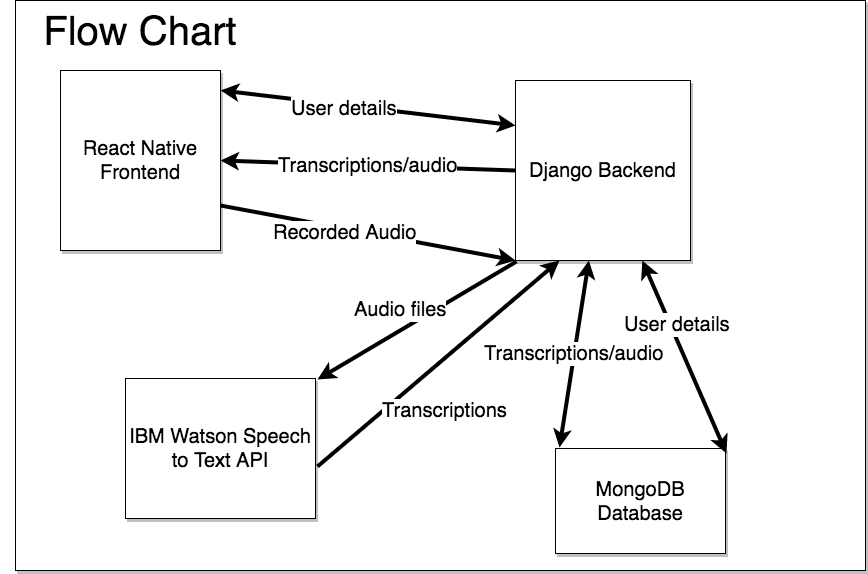
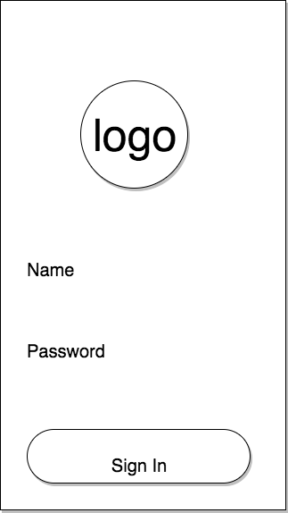
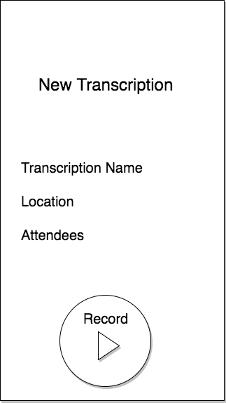
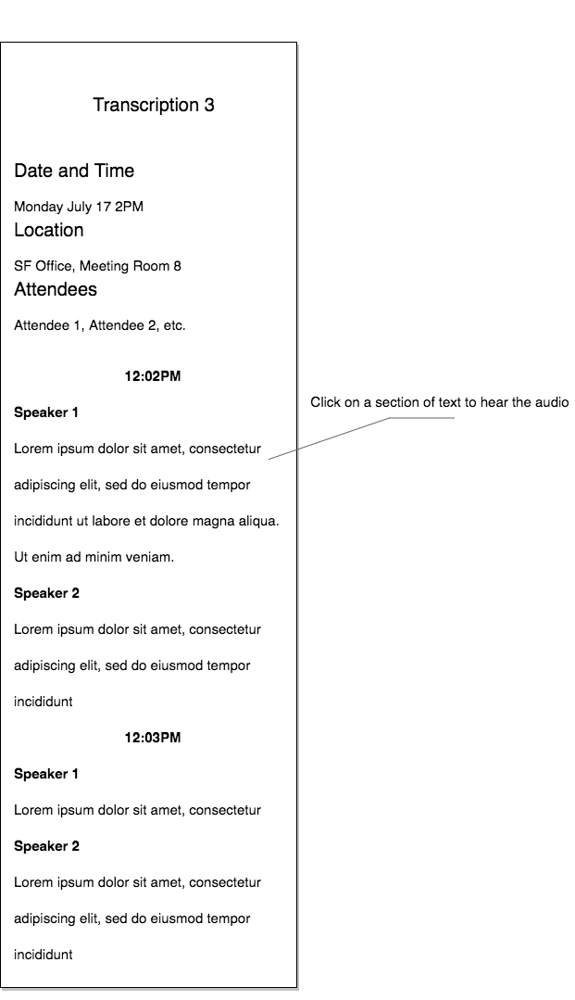
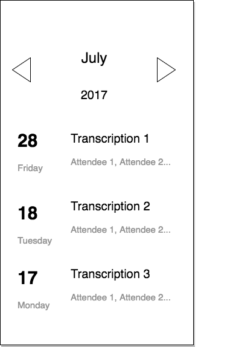

# Scriber Flex-Project Proposal

## Background and Overview

Transcription of interviews or meetings is a process which usually involves recording the full audio of the encounter, and then paying a service to transcribe it. We intend to design an app to create fast transcriptions of interviews and meetings, and allow users to view their transcriptions.

The app is broken down into a few parts:
- Recording the audio of the conversation
- Sending the data to the backend to be processed
- Implementing a speech-to-text API for automatic processing
- Writing the processed data into the database
- Developing an app to capture audio, and retrieve/display processed conversations

## Functionality and MVP

- [ ] React Native OAuth
- [ ] React Native App to display transcriptions
- [ ] Speech to text using IBM Watson API
- [ ] Django/Postgresql backend to store transcriptions and audio files
- [ ] App replays audio based on transcription timestamps

### Bonus

- [ ] Metadata analysis of transcriptions
- [ ] Posts/Comments on transcriptions

## Technologies and Technical Challenges

We are implementing MongoDB as our database to store users, transcriptions and audio files. Python Django will handle the communication between our app and Postgresql. Django will also handle using the Watson API to perform the speech-to-text. The app will be designed in React Native, and will record audio and display past transcriptions called up from the backend.

Some of the challenges we may face are:
- Learning the new technologies
- OAuth with React Native and Django
- Getting Django up and running
- Implementing the Watson API
- Differentiating between speakers in audio files

## Workflow/Wireframes

## Accomplished Over the Weekend

This weekend, we created a basic React Native interactive app for iOS. The app sends fetch requests, displays information and handles authentication. We have a Django server with the beginnings of OAuth set up, connected to a Postgresql database. We have also successfully transcribed some sample conversations using the Watson API, with speaker diarization and timestamps.

## Team Members and Work Breakdown

The team members are Ade Farquhar, Li Hsuan Lu, Spencer Chan, and Virginia Chen.

### Day 1

**Ade**
- Create basic React Native App
- Core functionality and setup

**Virginia**
- React Native features, authentication
- App design

**Li Hsuan**
- Implement Django framework
- Connect Django with Postgresql

**Spencer**
- Interface IBM Watson API
- Test audio formats, return format

### Day 2

**Ade**
- App structure, forms
- Auth (if necessary)

**Virginia**
- React native audio implementation
- Auth (if necessary)

**Li Hsuan**
- Django templates
- Routes, API endpoint setup

**Spencer**
- Process return data for storing in database

### Day 3

Work distribution TBD:

- Sending audio files from React Native to Django
- Implementing Watson API through Django
- App design
- Data processing for organization

### Day 4

- Automating audio transcription process
- Users can view their transcriptions
- Audio playback at timestamps
- API requests displaying on App

### Day 5

- Audio playback at timestamps
- Potential improvements on transcription quality
- App structure, user personalization

### Day 6

- UX cleanup
- Styling
- Seeding
- Production README
- Apple Developer enrollment
